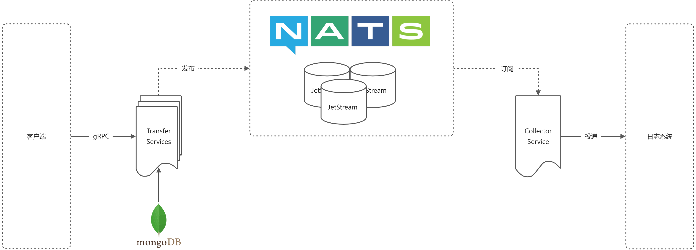

# Weplanx Transfer

[](https://github.com/weplanx/transfer)
[](https://goreportcard.com/report/github.com/weplanx/transfer)
[](https://github.com/weplanx/transfer)
[](https://raw.githubusercontent.com/weplanx/transfer/main/LICENSE)

日志传输器，配合日志采集器将相应的消息管道数据传输至支援的日志系统中。

> 版本 `*.*.*` 为 [elastic-transfer](https://github.com/weplanx/log-transfer/tree/elastic-transfer) 已归档的分支项目
> ，请使用 `v*.*.*` 发布的版本（预发布用于构建测试）

## 客户端

在 `go.mod` 项目中

```shell
go get github.com/weplanx/transfer
```

简单使用

```go
package main

import (
	"context"
	"fmt"
	"github.com/weplanx/transfer/client"
	"google.golang.org/grpc"
	"google.golang.org/grpc/credentials/insecure"
)

func main() {
	var opts []grpc.DialOption
	opts = append(opts, grpc.WithTransportCredentials(insecure.NewCredentials()))

	// 或者使用 TLS
	// certFile := "..."
	// creds, err := credentials.NewClientTLSFromFile(certFile, "")
	// if err != nil {
	// 	panic(err)
	// }
	// opts = append(opts, grpc.WithTransportCredentials(creds))

	transfer, err := client.New("127.0.0.1:6000", opts...)
	if err != nil {
		panic(err)
	}
	ctx := context.Background()
	result, err := transfer.GetLoggers(ctx)
	if err != nil {
		panic(err)
	}
	fmt.Println(result)
}
```

## 部署服务

日志传输器采用更广泛 gRPC 进行服务通讯，通过 NATS JetStream 处理消息流，除此之外还需要 MongoDB 作为配置存储介质



> 需要注意的是 NATS 与 MongoDB 仅支持集群模式，原因是 NATS JetStream 需要 3 或 5 个 nats-server 支持故障容错，而为了配置的一致性 MongoDB 采用副本集方式

镜像源主要有：

- ghcr.io/weplanx/transfer:latest
- ccr.ccs.tencentyun.com/weplanx/transfer:latest（国内）

案例将使用 Kubernetes 部署编排，复制部署内容（需要根据情况做修改）：

1. 设置配置

```yaml
apiVersion: v1
kind: ConfigMap
metadata:
  name: transfer.cfg
data:
  config.yml: |
    address: ":6000"
    tls: <TLS配置，非必须>
      cert:
      key:
    namespace: <命名空间>
    database:
      uri: mongodb://<username>:<password>@<host>:<port>/<database>?authSource=<authSource>
      name: <数据库名>
      collection: <默认集合>
    nats:
      hosts: [ ]
      nkey:
```

2. 部署

```yaml
apiVersion: apps/v1
kind: Deployment
metadata:
  labels:
    app: transfer
  name: transfer-deploy
spec:
  replicas: 2
  selector:
    matchLabels:
      app: transfer
  template:
    metadata:
      labels:
        app: transfer
    spec:
      containers:
        - image: ccr.ccs.tencentyun.com/weplanx/transfer:latest
          imagePullPolicy: Always
          name: transfer
          ports:
            - containerPort: 6000
          volumeMounts:
            - name: config
              mountPath: "/app/config"
              readOnly: true
      volumes:
        - name: config
          configMap:
            name: transfer.cfg
            items:
              - key: "config.yml"
                path: "config.yml"
```

3. 设置入口，服务网关推荐采用 traefik 做更多处理

```yaml
apiVersion: v1
kind: Service
metadata:
  name: transfer-svc
spec:
  ports:
    - port: 6000
      protocol: TCP
  selector:
    app: transfer
```

## 滚动更新

复制模板内容，并需要自行定制触发条件，原理是每次patch将模板中 `${tag}` 替换为版本执行

```yml
spec:
  template:
    spec:
      containers:
        - image: ccr.ccs.tencentyun.com/weplanx/transfer:${tag}
          name: api
```

例如：在 Github Actions
中 `patch deployment transfer-deploy --patch "$(sed "s/\${tag}/${{steps.meta.outputs.version}}/" < ./config/patch.yml)"`，国内可使用**Coding持续部署**或**云效流水线**等。

## License

[BSD-3-Clause License](https://github.com/weplanx/transfer/blob/main/LICENSE)

[](https://app.fossa.com/projects/git%2Bgithub.com%2Fweplanx%2Ftransfer?ref=badge_large)